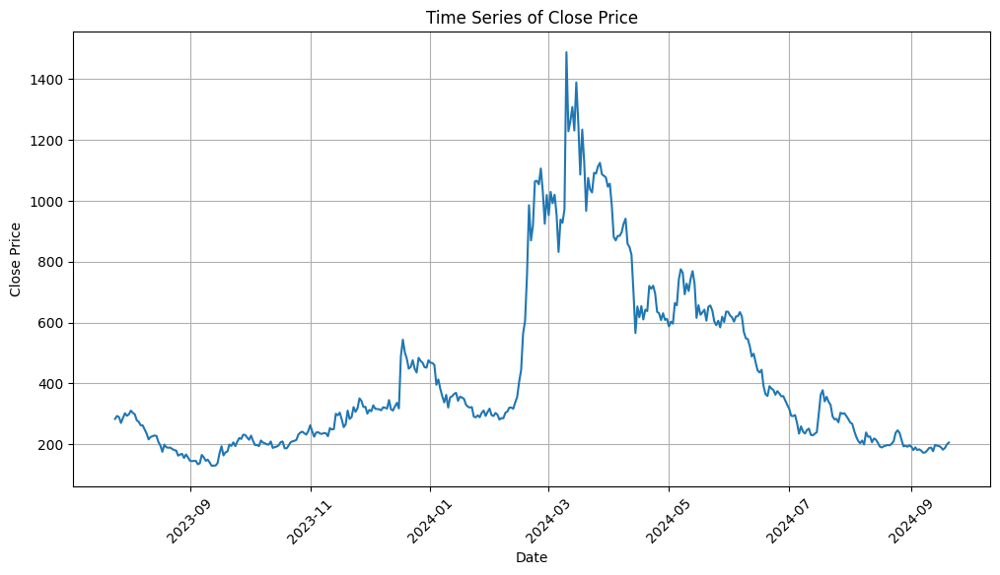

# Worldcoin Price Prediction

Hey there! Welcome to my Worldcoin Price Prediction project! 🌍💰

Predicting cryptocurrency prices is both thrilling and challenging, isn't it? Well, in this project, I'm diving headfirst into the exciting world of predicting the prices of Worldcoin using some cool machine learning techniques.

## Overview

You know how cryptocurrency markets are, right? Super volatile! But that's what makes them so fascinating for predictive modeling. In this project, I'm making use of historical data of Worldcoin prices to train some machine learning models to predict future prices.

## Features

### Data Exploration:

First things first, I gotta load and explore that historical Worldcoin price data using pandas. It's all about gaining insights into the dataset's structure and characteristics, you know?

### Modeling:

Time to get serious! I'm training several machine learning models, including Random Forest Regressor, Linear Regression, Gradient Boosting Regressor, and Support Vector Regressor. These bad boys are gonna help me predict Worldcoin prices based on various features like opening price, highest price, lowest price, volume, and market cap.

### Evaluation:

Gotta keep track of how well my models are doing, right? So, I'm evaluating the performance of each model using the mean squared error (MSE) metric. It's all about getting insights into their predictive capabilities.

### Interactive Prediction:

Oh yeah, this is where it gets fun! I've created an interactive interface for you to input new data and get predictions for future Worldcoin prices using my trained models.

## Usage

Ready to dive in and join the fun? Here's how you can get started with the Worldcoin Price Prediction project:

1. **Clone the Repository**: Go ahead, clone this repository to your local machine using `git clone`.

2. **Install Dependencies**: Don't forget to install all the required dependencies listed in the `requirements.txt` file using `pip install -r requirements.txt`.

3. **Explore the Data**: Fire up Jupyter Notebook or your favorite IDE, and start exploring that juicy historical Worldcoin price data. Get a feel for it and preprocess it as needed.

4. **Train Models**: Time to get those models trained up! Train various machine learning models using the preprocessed data to predict Worldcoin prices.

5. **Evaluate Performance**: Keep an eye on how well your models are doing. Evaluate their performance using metrics like mean squared error (MSE) to find the best-performing one.

6. **Make Predictions**: Now for the fun part! Use your trained models to make predictions on new data. Who knows, you might just predict the next big price jump!

## Contributing

Got any bright ideas, enhancements, or bug fixes? Awesome! I'm all ears. Feel free to open an issue or submit a pull request. Let's make this project even better together!

## Credits

This project was lovingly crafted by yours truly, Randell Mwania. Inspired by my passion for data science and the ever-exciting cryptocurrency markets.

---

Happy predicting! 🚀🔮
